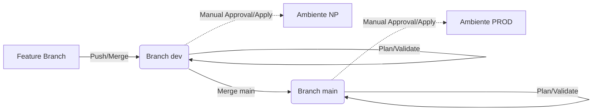

# 🎓 Terraform Foundation for Teaching

Bem-vindo ao repositório **Terraform Foundation for Teaching**! 🚀

Este projeto foi desenvolvido como um laboratório prático para ensinar os fundamentos de **Infraestrutura como Código (IaC)** utilizando o **Terraform**. A jornada do projeto leva o aluno desde os comandos manuais básicos até a automação completa com pipelines de CI/CD.

---

## 📖 Objetivo Pedagógico

O projeto está estruturado para demonstrar três pilares principais:
1.  **Fundamentos do Terraform**: Provider, Resources, Variables e Locals.
2.  **Modularização e Reuso**: Utilização de módulos oficiais da comunidade (VPC e S3).
3.  **Automação (O "Plus")**: Substituição do trabalho manual por pipelines automatizadas no GitHub Actions.

---

## 🛠️ Tecnologias Utilizadas

*   **Terraform** (>= 1.0) 🏗️
*   **AWS Provider** (~> 6.39) ☁️
*   **GitHub Actions** (CI/CD) ⚙️

---

## 📦 Infraestrutura Provisionada

Atualmente, o projeto utiliza módulos oficiais para garantir as melhores práticas:

*   **☁️ VPC (Rede)**: Provisionada via `terraform-aws-modules/vpc/aws`. Inclui sub-redes públicas/privadas e tags padronizadas.
*   **🪣 Armazenamento (S3)**: Provisionado via `terraform-aws-modules/s3-bucket/aws` para armazenar o estado remoto e/ou arquivos da aplicação, com versionamento ativado.
*   **🔐 Estado Remoto**: Configurado para armazenar o `terraform.tfstate` no S3, permitindo o trabalho colaborativo e seguro.

---

## 🚀 Como Utilizar

### 1. Etapa Manual (Aprendizado)

Para aprender como o Terraform funciona "debaixo do capô", os alunos começam executando os comandos localmente:

```bash
# Inicialize o backend e baixe os providers
terraform init -backend-config=backend/np.hcl

# Veja o plano de execução (Dry-run)
terraform plan -var-file="dev.tfvars"

# Aplique as mudanças na AWS
terraform apply -var-file="dev.tfvars"
```

### 2. Etapa Automatizada (O "Plus" com Pipeline)

Após entender a mecânica, introduzimos o **GitHub Actions**. Agora, o trabalho manual é substituído por uma automação acionada por eventos do Git:

*   **Ambiente Dev (NP)**: Acionado automaticamente ao fazer push para a branch `dev`.
*   **Ambiente Prod**: Acionado automaticamente ao fazer push ou merge para a branch `main`.

**Vantagens da Pipeline:**
- **Consistência**: O plano gerado no `plan` é exatamente o que é aplicado no `apply` via artefatos.
- **Segurança**: Credenciais AWS ficam protegidas nos Secrets do GitHub.
- **Histórico**: Todo o log de alteração da infraestrutura fica visível no histórico do workflow.

---

## 🌳 Estratégia de Branching (Gitflow)

Para organizar o desenvolvimento e garantir a estabilidade da infraestrutura, utilizamos um fluxo de trabalho baseado em branches:

1.  **Feature Branches** (`feature/nome-da-mudança`): Onde as novas implementações começam. 
2.  **Branch `dev`**: 
    *   Representa o ambiente de **Non-Prod (Desenvolvimento)**.
    *   **Trigger**: No `push` ou `merge`, a pipeline de NP é acionada.
3.  **Branch `main`**: 
    *   Representa o ambiente de **Produção**.
    *   **Trigger**: Apenas merges aprovados aqui disparam a pipeline de Produção.

### Fluxo de Trabalho (Workflow):



*   **A Pipeline é a Autoridade**: A validação (`validate`) e o planejamento (`plan`) da infraestrutura são realizados automaticamente pela pipeline ao detectar um push ou merge.
*   **Apply Manual para Controle Total**: O `terraform apply` **não acontece automaticamente**. Ele exige uma aprovação manual (clique no botão de aprovação no GitHub) para garantir que você tenha controle total sobre o que sobe para os ambientes de NP e PROD.
*   **Merge Request como Garantia**: O fluxo de trabalho deve sempre passar por um Merge Request para revisão entre pares, garantindo a integridade do estado (state).

---

## 📁 Estrutura do Projeto

*   `/backend`: Configurações de state remoto para diferentes ambientes (`np.hcl`, `prod.hcl`).
*   `.github/workflows`: Definições das pipelines de **CI/CD** (`ci-cd-np.yml` e `ci-cd-prod.yml`).
    *   **CI (Integração Contínua)**: Validação e Plano executados automaticamente.
    *   **CD (Entrega Contínua)**: Aplicação **manual** da infraestrutura após aprovação no ambiente correspondente.
*   `network.tf`: Definição da malha de rede.
*   `storage.tf`: Definição do bucket de estado/armazenamento.
*   `main.tf`: Configurações globais do provider e versões.

---

## 📜 Licença

Consulte o arquivo [LICENSE](./LICENSE) para mais detalhes.

---
*Este repositório é mantido para fins didáticos por [lucascosm3](https://github.com/lucascosm3).*
