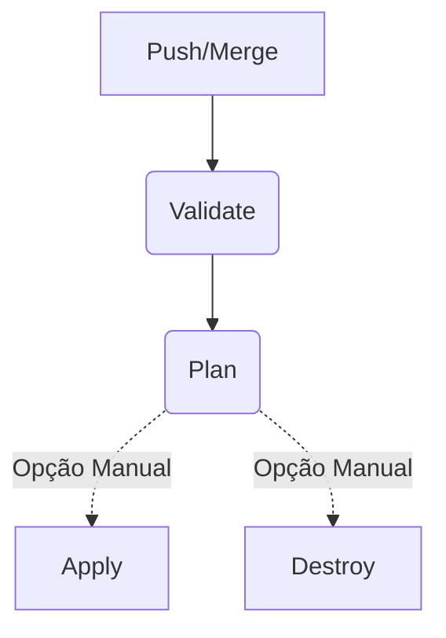

# 🎓 Terraform Foundation for Teaching

Bem-vindo ao repositório **Terraform Foundation for Teaching**! 🚀

Este projeto foi desenvolvido como um laboratório prático para ensinar os fundamentos de **Infraestrutura como Código (IaC)** utilizando o **Terraform**. A jornada do projeto leva o aluno desde os comandos manuais básicos até a automação completa com pipelines de CI/CD.

---

## 📖 Objetivo Pedagógico

O projeto está estruturado para demonstrar três pilares principais:
1.  **Fundamentos do Terraform**: Provider, Resources, Variables e Locals.
2.  **Modularização e Reuso**: Utilização de módulos oficiais da comunidade (VPC e S3).
3.  **Automação (O "Plus")**: Substituição do trabalho manual por pipelines automatizadas no GitHub Actions.

---

## 🛠️ Tecnologias Utilizadas

*   **Terraform** (>= 1.0) 🏗️
*   **AWS Provider** (~> 6.39) ☁️
*   **GitHub Actions** (CI/CD) ⚙️

---

## 📦 Infraestrutura Provisionada

Atualmente, o projeto utiliza módulos oficiais para garantir as melhores práticas:

*   **☁️ VPC (Rede)**: Provisionada via `terraform-aws-modules/vpc/aws`. Inclui sub-redes públicas/privadas e tags padronizadas.
*   **🪣 Armazenamento (S3)**: Provisionado via `terraform-aws-modules/s3-bucket/aws` para armazenar o estado remoto e/ou arquivos da aplicação, com versionamento ativado.
*   **🔐 Estado Remoto**: Configurado para armazenar o `terraform.tfstate` no S3, permitindo o trabalho colaborativo e seguro.

---

## 🚀 Como Utilizar

### 1. Etapa Manual (Aprendizado)

Para aprender como o Terraform funciona "debaixo do capô", os alunos começam executando os comandos localmente:

```bash
# Inicialize o backend e baixe os providers
terraform init -backend-config=backend/np.hcl

# Veja o plano de execução (Dry-run)
terraform plan -var-file="dev.tfvars"

# Aplique as mudanças na AWS
terraform apply -var-file="dev.tfvars"
```

### 2. Etapa Automatizada (O "Plus" com Pipelines)

Após entender a mecânica, introduzimos o **GitHub Actions**. O trabalho agora é consolidado em pipelines que cuidam de todo o ciclo de vida por ambiente:

*   **🔍 Validação e Plano**: Automáticos a cada push, garantindo feedback imediato.
*   **🚀 Opções Manuais**: Após o plano, você decide o próximo passo: **Aplicar** as mudanças ou **Destruir** os recursos para limpeza.

---

## ⚙️ Configuração Necessária no GitHub

Para que as paradas manuais funcionem corretamente, você deve configurar os **Environments** no seu repositório:

1.  Acesse **Settings** > **Environments**.
2.  Crie os seguintes ambientes:
    *   `dev` e `dev-destroy` (ambiente Non-Prod).
    *   `prod` e `prod-destroy` (ambiente Produção).
3.  Em cada ambiente, ative a opção **Required reviewers**.

---

## 🌳 Estratégia de Branching (Gitflow)

1.  **Feature Branches**: Onde as novas implementações começam. 
2.  **Branch `dev`**: Representa o ambiente de **Desenvolvimento**. O `push` aqui dispara a pipeline de NP.
3.  **Branch `main`**: Representa o ambiente de **Produção**. O `merge` aqui dispara a pipeline de Produção.

### Fluxo de Trabalho (Workflow):
 


---

## 📁 Estrutura do Projeto

*   `/backend`: Configurações de state remoto (`np.hcl`, `prod.hcl`).
*   `.github/workflows`: 
    *   `ci-cd-np.yml`: Pipeline completa para o ambiente de Desenvolvimento.
    *   `ci-cd-prod.yml`: Pipeline completa para o ambiente de Produção.
*   `network.tf`, `storage.tf`: Definições de infraestrutura.
*   `main.tf`: Configurações globais e versões.

---

## 🧹 Limpeza de Recursos

Para evitar custos desnecessários na sua conta AWS:

1.  Acesse a aba **Actions**.
2.  Selecione a execução mais recente da pipeline do ambiente que deseja limpar.
3.  No grafo de execução, localize o job **Terraform Destroy** ao final do fluxo.
4.  Clique em **Review deployments**, selecione o ambiente de limpeza (`-destroy`) e aprove.

---

## 📜 Licença

Consulte o arquivo [LICENSE](./LICENSE) para mais detalhes.

---
*Este repositório é mantido para fins didáticos por [lucascosm3](https://github.com/lucascosm3).*
